## MDW 6 Demo
### 1. Setup Eclipse with MDW Plug-In

- Make sure Java Runtime 1.8.x is installed on your computer:
  http://www.oracle.com/technetwork/java/javase/downloads
  
- Set JAVA_HOME to JDK 1.8.X:                                                                                                                                           
  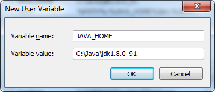
                                                                                                                                                                        
- Set the path:  %PATH%;%JAVA_HOME%\bin;  

- Install Eclipse Neon (4.6.x) for JavaEE Developers:  [https://www.eclipse.org/downloads](https://www.eclipse.org/downloads)

- Launch Eclipse:
  Here is an example command line that includes appropriate JVM memory settings for running and debugging:
  C:\eclipse_4.6.2\eclipse.exe -vm C:\Java\jdk1.8.0_91\bin\javaw.exe -vmargs -Xms512m -Xmx1024m
  
- Install the latest version of the MDW Plug-In via Eclipse Software Updates (Help > Install New Software > Add > http://centurylinkcloud.github.io/mdw/designer/updateSite > Install):

  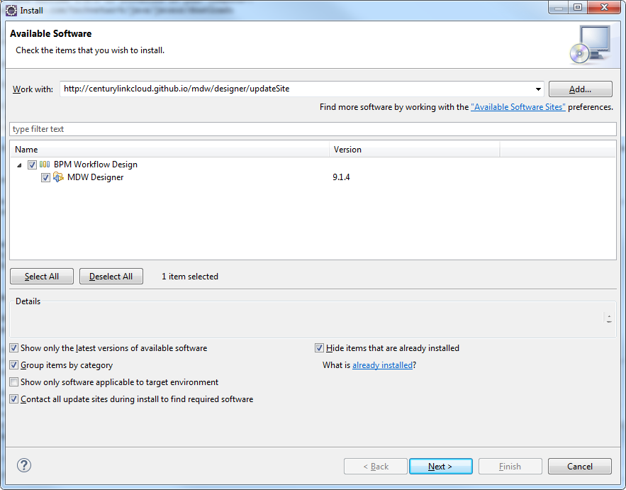
  
- Click Next and Finish

  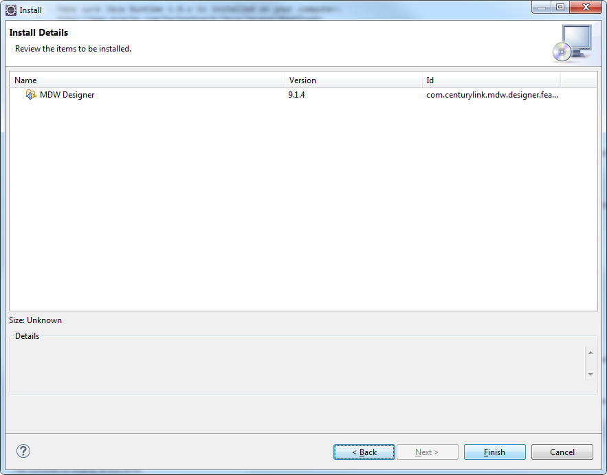

- Buildship (Gradle) Plugin:                            
  [http://download.eclipse.org/buildship/updates/e46/releases/2.x](http://download.eclipse.org/buildship/updates/e46/releases/2.x)
  
- Configure your Eclipse with Java 1.8.x installed JRE available in your workspace (Window > Preferences > Java > Installed JREs > Add):
  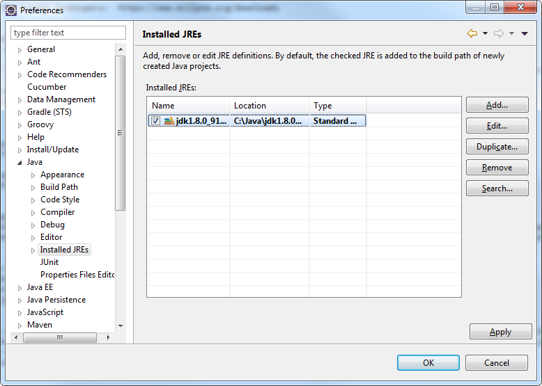

#### Optional Plug-Ins:
- Groovy Eclipse Plug-In (Groovy script syntax highlighting, auto-complete, etc.):     
  http://dist.springsource.org/snapshot/GRECLIPSE/e4.6
  
- Yaml:    
  http://dadacoalition.org/yedit
  
- Quantum DB Plug-In (Database querying):    
  http://quantum.sourceforge.net/update-site
  
#### Supported Java Container (Apache Tomcat 8)  
You can perform many cloud development activities using a remote workflow project.  However, there are certain advantages to being able to deploy locally.  To be able to develop locally you need an Apache Tomcat: https://tomcat.apache.org.

## mdw-demo Project

#### Add Git Repository:
- The mdw-demo workflow project is hosted in the MDW AppFog Git Repository.  If you prefer to use command line Git, clone the repository from 
  https://github.com/CenturyLinkCloud/mdw-demo.git. 
  
#### Clone mdw-demo project into your workspace:
- Access the Git Repositories view by selecting Window > Show View > Other > Git > Git Repositories:
- Copy the repository URL into your clipboard: https://github.com/CenturyLinkCloud/mdw-demo.git
- Right-click in Git Repositories view and select Paste Repository Path or URI.
- Note: The User and Password are not required to clone the mdw-demo project.

  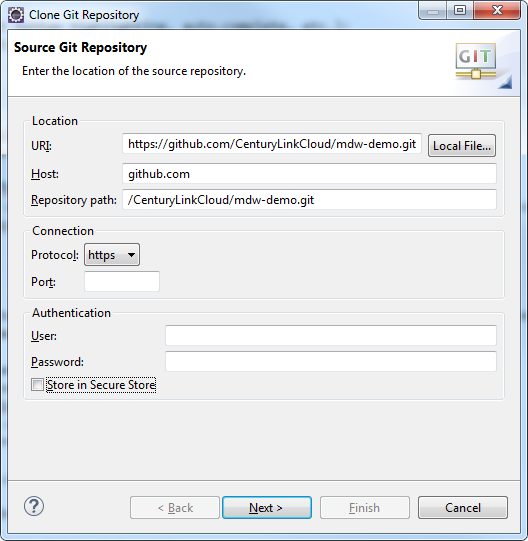
  
- Click Next and make sure the master branch is selected:

  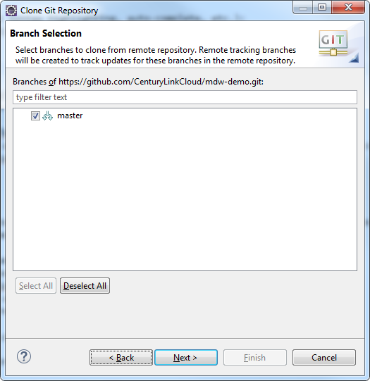
  
- Click Next again and point to your workspace for the Destination Directory.  
- Check "Import all existing Eclipse projects after clone finishes".  Then click Finish.

  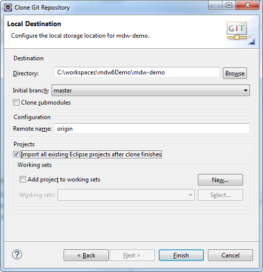
  
- Edit **mdw-demo/config/mdw.properties** file to suit your environment. Make sure the mdw.asset.location is set to your mdw-demo/assets location and mdw.git.local.path is set your mdw-demo project 
  path on your machine. Here is an example: 
	
    	mdw.asset.location=C:/workspaces/mdw6Demo/mdw-demo/assets
    	mdw.git.local.path=C:/workspaces/mdw6Demo/mdw-demo

### 2. MDW Designer Perspective
- To best view the workflow assets, switch to Designer Perspective (Window > Perspective > Open Perspective > Other > MDW Designer).
- In Process Explorer view expand the mdw-demo project to see the included workflow packages.
- It will make more sense after you have gone through creating your first workflow process. But for now, you can take a look at the demo intro 
  process to get a feel for it by opening the com.centurylink.mdw.demo.intro package and double click the HandleOrder process in the mdw-demo 
  project and you will be able to view the demo Process design model.
 
### 3. Build and Update mdw-demo project
Before you can deploy your demo project to your server, you will need to do the following:
- On your eclipse, switch to Java perspective.

- Right-click your mdw-demo project and select MDW Update > `Update Framework Libraries`.  You only need to do this once to download the mdw.war file to be deployed into the deploy/webapps directory.

- Now you will need to do the gradle build: 
    - Go to Window > Show View > Other and expand Gradle and select Gradle Tasks and click Ok.  
   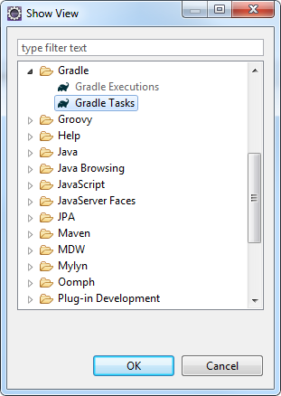 
    - Expand the mdw-demo project from the Gradle Tasks, click `clean` and once it is done cleaning, click `build`: 
   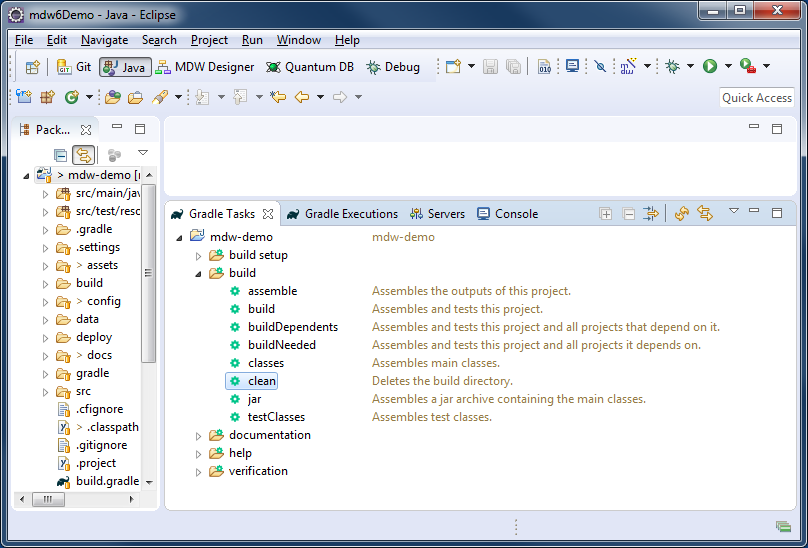   
    
    - If the gradle build was successful, you will see all tasks are green as shown on the screenshot bellow:
   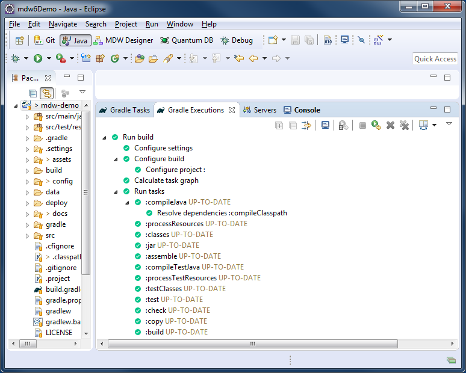  
  
 
 - Now you will need to do an eclipse build: Open Project from the menu and click `Clean`. This will clean and build your mdw project so that it can be deployed to the server.

`Note: Eclipse sometimes will override some of the files without asking you. So you will need to replace them with the original from the GitHub, in order to avoid any issues while trying to add your mdw-demo project to the Tomcat server instance. So do the following:` 
- After you do the gradle build, expand the `.settings` folder (if you do not see this folder, check the Filters) and replace the following files from GitHub (right click > Replace With > Head Revision) :
    - org.eclipse.wst.common.component
    - org.eclipse.wst.common.project.facet.core.xml
 - Also check the .classpath and .project files and if they have been modified, replace them as well.  

 
  
### 4. Tomcat Setup & Running a Process                              

#### Create Tomcat Server:
- To execute a workflow process you need a server running with MDW deployed.  For debugging in Eclipse the easiest way to set this up is through a Web Tools Platform server instance. 
  From the menu select File > New > Other > Server > Server.  Click Next and select Apache > Tomcat 8.0 (MDW) from the options.  To be able to debug your Dynamic Java it's important that 
  you select Tomcat 8.0 (MDW) instead of the standard Tomcat 8.0 Server.  The server name is arbitrary, so you can give it something friendlier than the default.
  
  
  
- If you've not previously used a Tomcat 8 runtime in Eclipse, clicking Add takes you to a page where you specify your Tomcat location.   Make sure to select a JDK to compile the code and 
  that the selected JDK is Java 1.8.x
  
  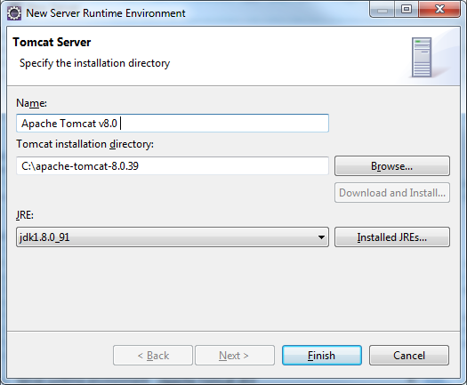
  
- The final page of the New Server wizard is where you designate your workflow project to be deployed on the server.  After that, click Finish to create the server instance.
- If the Servers view is not visible in your current perspective, from the menu select Window > Show View > Other > Server > Servers.  You should see your Tomcat 8 server in this view.  
  You can double-click the server to edit its configuration.  Expand the Timeouts section, change the start timeout value to 3600 seconds, and hit Ctrl-S to save your changes.  Then close
  the editor.
  
  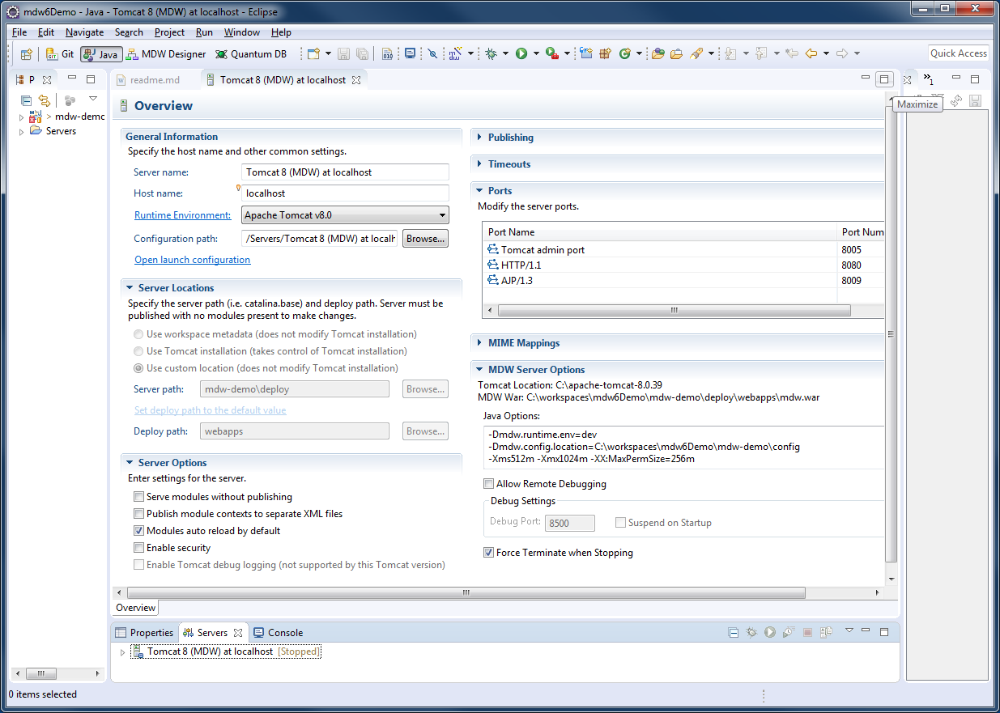
 
- Before you start the server, you will need to add your mdw-demo project to your server instance. Right click the server instance, select Add and Remove… and select the mdw-demo from the 
  left pane and click the Add to move it to the right pane.
  
  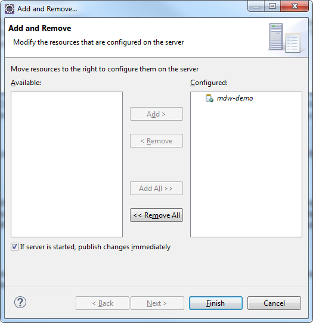
                          
#### Run Tomcat:
- Now that you've created the WTP server instance, the Servers view gives you a handy way to start and stop Tomcat.  And output is directed to the Eclipse Console view, where you can click on stack 
  traces to open associated source code (including MDW Framework code and Dynamic Java).  Start your server in debug mode by right-clicking on it and selecting Debug (or use the icon in the Servers view
  toolbar).
- The first time you start your server Tomcat explodes the mdw.war file in your deploy/webapps directory and caches the deployable content.  This can sometimes take a minute.  With the server running 
  you should see MDW output in the Eclipse Console view.  You can safely ignore any Dynamic Java compilation errors unless they pertain to the custom activity you created in.

#### Deploy:
When you upgrade to a new MDW build version in Eclipse, Designer automatically downloads the corresponding mdw.war file into your deploy/webapps directory.  If at any time you want to clean out the MDW deployment and start fresh, you can delete mdw.war and the exploded mdw directory (and for a very thorough cleansing you can even delete the Tomcat cache under deploy/work/Catalina/localhost/mdw).  Then you can deploy from scratch from Package Explorer view by right-clicking on your workflow project and selecting MDW Update > Update Framework Libraries.
- Make sure your project is added to your Java Build Path/Source. You will need to do this from a Java or Resource perspective.
- You can confirm that MDW was successfully deployed by accessing MDWHub in your browser:
  [http://localhost:8080/mdw](http://localhost:8080/mdw)
 
### 5. To get started with the MDW Demo project, refer to the [MDW Designer User Guide](http://centurylinkcloud.github.io/mdw/docs/designer/user-guide/).

